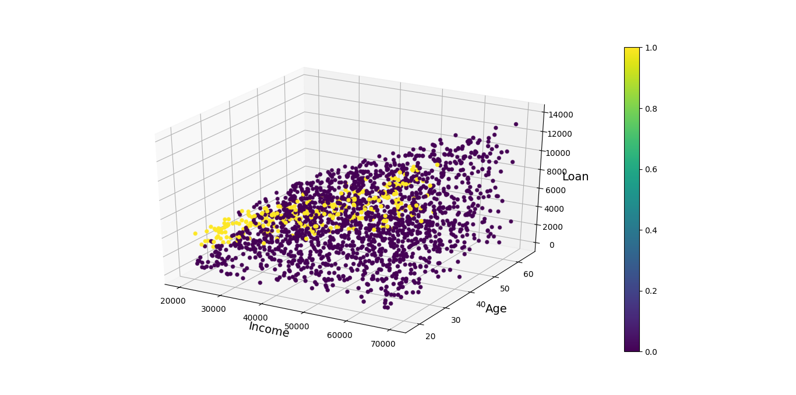

# Directory Structure
```text
.
├── api_test.py
├── app.py
├── data
│   └── credit_data.csv
├── docker-compose.yml
├── Dockerfile
├── figures
│   ├── Figure_cm-accuracy:0.99criterion:entropymax_depth:10max_features:Nonemin_samples_leaf:1n_estimators:20RandomForest-gs.png
│   ├── Figure_cm-accuracy:0.99RandomForest.png
│   ├── Figure_digits.png
│   ├── RandomForest-graph-gs.png
│   └── RandomForest-graph.png
├── graph
│   ├── RandomForest-graph.dot
│   └── RandomForest-graph-gs.dot
├── README.md
├── requirements.txt
├── run.py
├── utils
│   ├── data.py
│   ├── __init__.py
│   ├── model.py
│   └── plot.py
└── weights
    ├── RandomForest-gs-adct9.pkl
    └── RandomForest-gs-ub4jp.pkl

5 directories, 21 files
```
# Command Line Interface
```text
usage: run.py [-h] [--load LOAD] [--gs GS]

optional arguments:
  -h, --help   show this help message and exit
  --load LOAD  True: Load trained model False: Train model default: True
  --gs GS      Find optimal parameters with 10-Fold GridSearchCV
```

# Install Graphviz to Visualize DecisionTree
```shell
 sudo apt install graphviz
 ```

# Plot data
### Features: Income, Age, Loan
### Labels: Default or not




```text
Note: Data is very inbalance
```

## Plot Train & Test data with 2D PCA


# Train the RandomForest model

## Experiment 1

### RandomForestClassifier Parameters
```text
n_estimators: 10
```

```text
criterion: entropy
```

```text
max_features: sqrt
```
### CLI

```shell
python run.py --load no --gs no
```

### Confusion Matrix


### Accuracy Score: 0.99

### Visualize the trained RandomForestClassifier


## Experiment 2 - Run the 10Fold GridSearchCV

### Parameters
```text
n_estimators: 10,20
```
```text
max_depth: 1,5,10,15
```
```text
min_samples_leaf: 1,2,3,4
```
```text
criterion: gini, entropy
```
```text
max_feature: sqrt, log2, None (n_features)
```

### CLI

```shell
python run.py --load no --gs yes
```
### Confusion Matrix


### Accuracy Score: 0.99

### Optimal Parameters with GridSearchCV
```text
n_estimators: 20
```
```text
max_depth: 10
```
```text
min_samples_leaf: 1
```
```text
criterion: entropy
```
```text
max_feature: None (n_features)
```
### Visualize the trained RandomForestClassifier


# Docker for the RandomForestClassifier  model

## Build the Docker image

You can build docker image by following:

```shell
docker-compose build
```

## Run Docker container

You can launch a container from the Docker image by following:

```shell
docker-compose up
```